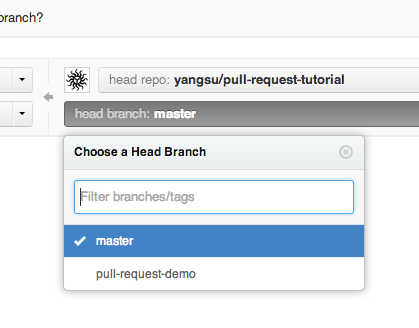
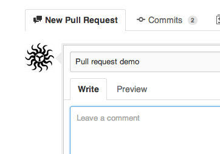

# ICFTIPS2019
Code repository for algorithm and data structure problems discussed during ICF TIPS 2019 Spring session

## Repository Structure
    1. Each section is checked in under corresponding folder ex "recursion" , "trees", "arrays etc.
    2. Each problem is filed under the corresponding section with its name.
    3. Every problem has a README with the problem details and and sample input. Note : Not all possible cases may be covered by these input. You are encouraged to try your solution with all possible inputs.
    4. Students are encourage to submit pull request with solution in their language of choice. Accepted solutions will be approved and merged into master. "Master" branch is configured as a protected branch. 
    
## Steps to submit code for review
1. Clone the repo (initial)
2. Get the latest from master.
``` 
git checkout master   
git fetch origin  
git reset --hard origin/master   
```
3. Create a branch for the problem you want to solve. The branch should follow the Naming Convention : **YourName-ProblemName**. 
``` git checkout -b Shahnawaz-IsValidBST ```
4. Work on the problem and commit code to your branch. **Include the time and space complexity as a comment in your source code** like below
```     
    // T - O(n) where n is the number of elements
    // S - O(log n) where n is the number of elements
```
Commit the code to your branch
```
git status
git add <some-file>
git commit
git push origin
```
5. Log in to git and submit a pull request.
Go to the repository page on github. And click on "Pull Request" button in the repo header.


Pick "master" as the  branch you wish to have merged using the "Head branch" dropdown. Make sure that the base repo and base branch are set correctly.




Enter a title and description for your pull request. Remember you can use Github Flavored Markdown in the description and comments



Finally, click on the green "Send pull request" button to finish creating the pull request.

