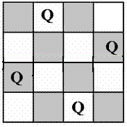

## # N Queen Problem
The N Queen is the problem of placing N chess queens on an N×N chessboard so that no two queens attack each other.  
Problem statement: Place N queens on an NxN chessboard, such that no two queens are in
line of attack of each other. In chess (and in real life too), a queen can move as far as she
pleases, horizontally, vertically, or diagonally.  
Input: N
Output: All possible arrangements of N queens on the board.
For example, following is a solution for 4 Queen problem.

[Explanation of solution](https://www.youtube.com/watch?v=xouin83ebxE)